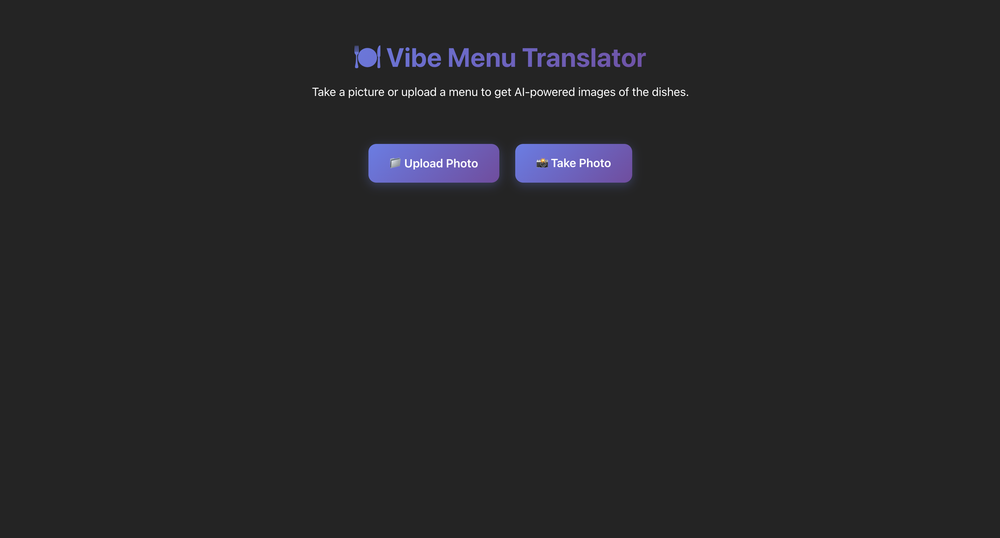
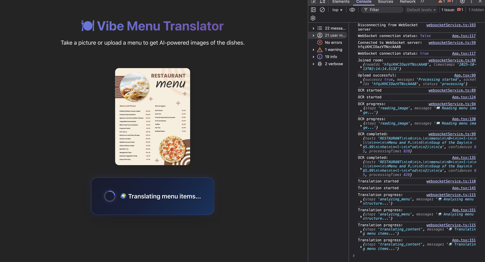
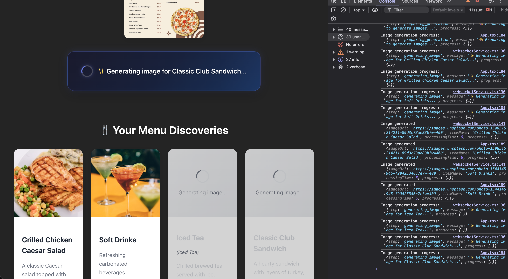
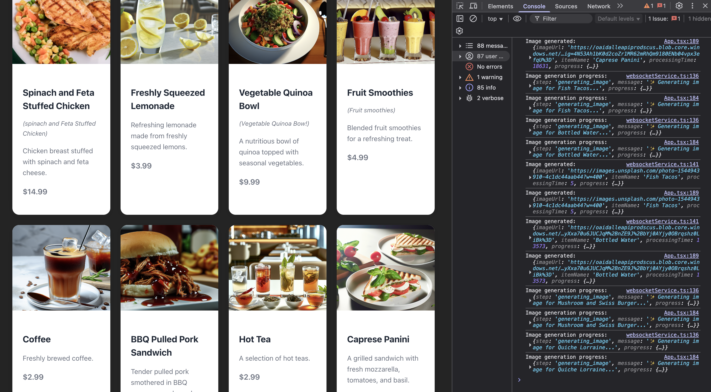
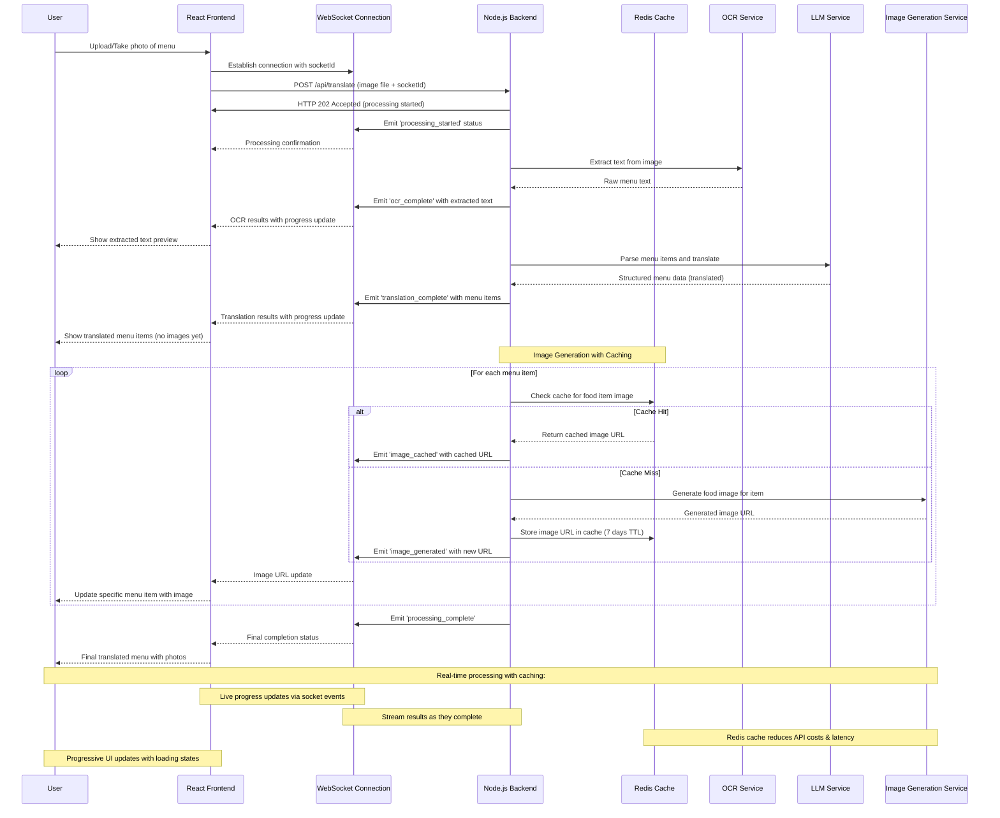

# 🍜 Vibe Menu Translator
I got bored, so I wanted to see how far I can go by simplying vibe coding.    

## Idea: 
Basically you snap a pic of a menu or upload a manu, the it generates a sample food pic using SORA  

## What it does

- Upload a photo of any menu
- OCR extracts all the text 
- AI translates everything to English
- Generates appetizing food images for each dish
- Real-time updates via websockets because why not
- Redis caching so I don't blow my OpenAI budget 💸

Built this mostly to avoid ordering mystery dishes when traveling, but it turned into a nice little tech playground.

## Demo

### Home Page

### Image uploaded, OCR + image generation begins

### Image generation responses start coming in

### Image generation complete

## Tech Stack (aka what I threw together)

**Frontend:**
- React 19 
- TypeScript
- Vite 
- Socket.io client

**Backend:**
- Node.js + Express
- TypeScript
- Socket.io
- Tesseract.js (OCR magic)
- OpenAI API
- Redis (cache images to avoid duplicate generation)

## Architecture

Here's how this beautiful mess works:

## Getting Started

1. Clone this bad boy
2. Copy `.env.example` to `.env` and add your OpenAI API key
3. Fire up Redis: `docker-compose up -d`
4. Install deps: `npm install`
5. Run the thing: `npm run dev`
6. Hit `http://localhost:5173` and start uploading menu pics!

## Features

- **Real-time processing**: Watch your menu get translated step by step
- **Smart caching**: Same dish? Cached image. Your wallet will thank you.
- **Fallback images**: If image generation fails, we've got backup pics from Unsplash
- **Progressive updates**: No more staring at loading spinners
- **Mobile friendly**: Take pics directly from your phone camera

## Future Ideas (maybe if I get bored again)

- [ ] Support for more languages
- [ ] Nutritional info extraction
- [ ] Price conversion
- [ ] Restaurant recommendations
- [ ] Dietary restriction filtering
- [ ] Menu item reviews/ratings

## Credits

Pretty much built with Claude Code

